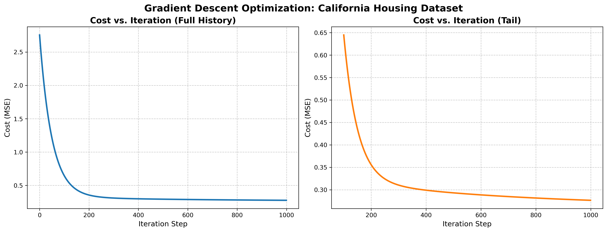

# California Housing Prices: Multiple Variable Linear Regression

## Project Overview
To deepen my understanding of machine learning algorithms, I built a **Multiple Variable Linear Regression** model from scratch using Python and NumPy. Instead of relying on pre-built model libraries, I manually implemented gradient descent to predict California housing prices based on 8 distinct socioeconomic and geographic features.

## Core Technical Achievements
* **Feature Scaling (Z-Score Normalization):** Implemented standardization from scratch to ensure convergence, as features like `Population` and `AveRooms` operated on drastically different scales.
* **Vectorized Gradient Descent:** Replaced slow nested `for` loops with optimized matrix multiplications to handle all 20,640 dataset rows efficiently.
* **Cost Function Optimization:** Tracked the Mean Squared Error (MSE) across 1,000 iterations to verify algorithm convergence.

## Optimization Results
The learning curve below proves the model successfully minimized the cost function without diverging, thanks to appropriate feature scaling and learning rate tuning ($\alpha = 0.01$).

## How to Run
1. Clone the repository: `git clone https://github.com/Nilcs2/California-Housing-Multiple-Variable-Linear-Regression.git`
2. Install dependencies: `pip install -r requirements.txt`
3. Run the notebook: `jupyter notebook project_california_housing.ipynb`

---
*Author: Nilesh Singh | Master's Student, Computer Engineering at SDSU*
